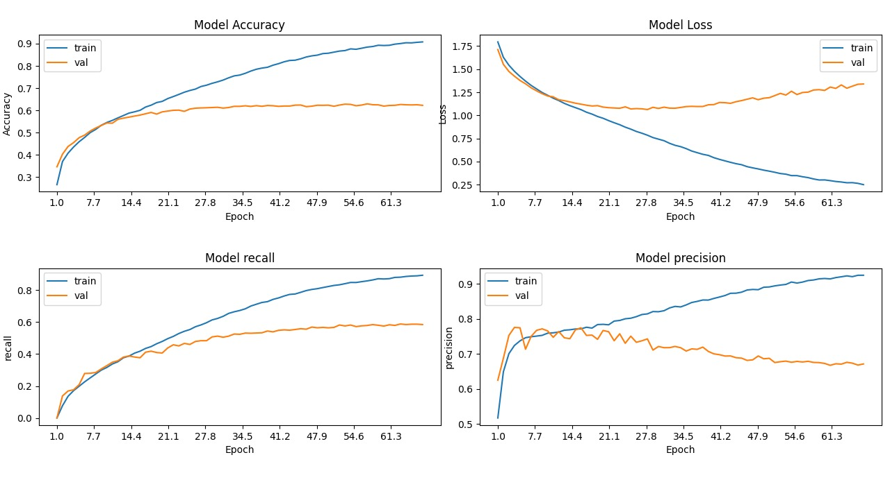

# 😃 Emotion, Age, Gender, and Face Recognition

This project was developed as part of a **Deep Learning course project**.  
We were required to upgrade an existing system — the upgrade I made was **adding emotion detection** to a project that originally performed **age, gender, and face recognition**.

---

## 📌 Original Project Reference

The original base project was taken from:

🔗 [Data Flair – Age & Gender Detection](https://data-flair.training/blogs/python-project-gender-age-detection/)  
📹 [Demo Video on YouTube](https://www.youtube.com/watch?v=CPtBakonno8)  

Another helpful resource that contributed to the final version of the project:  
🔗 [GitHub – Face Recognition by tripathivenkteshwar](https://github.com/tripathivenkteshwar/faceDetection)

---

## 💡 Upgrade – Emotion Detection

The added functionality in this upgraded version is **emotion recognition**, based on a deep learning model trained on facial expressions.

### 🎯 Supported Emotions:
- Angry
- Disgusted
- Fearful
- Happy
- Sad
- Surprised
- Neutral

### 🧠 Dataset Used:
We used the **FER2013 dataset** available on Kaggle:  
🔗 [FER2013 Dataset on Kaggle](https://www.kaggle.com/datasets/deadskull7/fer2013)

---

## 🏆 Model Performance

Below is a visualization of the best-performing model based on training and validation metrics:

- Top-left: Accuracy over epochs  
- Top-right: Loss over epochs  
- Bottom-left: Recall  
- Bottom-right: Precision

---

## 📦 Final Project Download

Due to large file sizes, the complete final version of the project is hosted on Google Drive:

📁 [Download Final Version from Google Drive](https://drive.google.com/drive/u/1/folders/13SxXxBu8q_62XFSgpbuH9IE7xD6xXTiv)

---

## 🛠️ Technologies & Libraries Used

- 📚 TensorFlow / Keras – [tensorflow.org](https://www.tensorflow.org/guide/keras)  
- 📊 Matplotlib – [matplotlib.org](https://matplotlib.org/2.0.2/users/pyplot_tutorial.html)  
- 🎥 OpenCV – [opencv-python on PyPI](https://pypi.org/project/opencv-python/)  
- 🗂️ OS module – [docs.python.org](https://docs.python.org/3/library/os.html)

---

## 📬 Contact

Created by **Fadi Srouji and Ghasan Ashkar**

- 📧 Email: fadi_sroujii@outlook.com  
- 🔗 LinkedIn: [linkedin.com/in/fadisrouji](https://www.linkedin.com/in/fadisrouji)  
- 💼 GitHub: [github.com/FadiSro](https://github.com/FadiSro)

Project Partner: **Ghasan Ashkar**  
- 🔗 LinkedIn: [linkedin.com/in/ghasan-ashkar-61924b2a3](https://www.linkedin.com/in/ghasan-ashkar-61924b2a3)

---
